# AI工具箱架构设计文档

## 目录

- [1. 项目概述](#1-项目概述)
- [2. 技术栈](#2-技术栈)
- [3. 系统架构](#3-系统架构)
- [4. 后端架构设计](#4-后端架构设计)
- [5. 前端架构设计](#5-前端架构设计)
- [6. 数据库设计](#6-数据库设计)
- [7. API接口设计](#7-api接口设计)
- [8. 安全架构](#8-安全架构)
- [9. 部署架构](#9-部署架构)
- [10. 数据流设计](#10-数据流设计)
- [11. 扩展性设计](#11-扩展性设计)
- [12. 性能优化策略](#12-性能优化策略)

---

## 1. 项目概述

### 1.1 项目简介

AI工具箱是一个基于Vue 3 + Spring Boot 3的前后端分离平台，提供AI应用展示、知识库管理、AI案例、资讯和AI问答等功能。平台旨在为用户提供一站式的AI工具资源整合和智能问答服务。

### 1.2 核心功能

| 模块 | 功能描述 |
|------|---------|
| **AI应用** | 应用列表展示、分类筛选、关键词搜索、应用详情、浏览统计 |
| **知识库** | 知识文章管理、分类浏览、标签搜索、点赞收藏 |
| **AI案例** | 行业案例展示、案例详情、实施效果展示 |
| **资讯** | 最新AI资讯、热门资讯、资讯分类 |
| **AI问答** | 智能对话、历史记录、多轮对话 |
| **用户系统** | 用户注册登录、JWT认证、权限管理 |
| **管理后台** | 应用管理、知识库管理、资讯管理、用户管理、数据概览 |

---

## 2. 技术栈

### 2.1 后端技术栈

```
Spring Boot 3.2.0
├── Spring Security 6.x          # 安全框架
├── MyBatis-Plus 3.5.8           # ORM框架
├── MySQL 8.0                    # 关系型数据库
├── Redis 7.x                    # 缓存中间件
├── JWT (JJWT 0.12.3)           # Token认证
├── Lombok                       # 简化代码
├── Hutool 5.8.24               # 工具类库
└── Apache Commons Lang3         # 工具类库
```

### 2.2 前端技术栈

```
Vue 3.4.0 (Composition API)
├── TypeScript 5.3.3             # 类型系统
├── Element Plus 2.5.0          # UI组件库
├── Pinia 2.1.7                 # 状态管理
├── Vue Router 4.2.5            # 路由管理
├── Axios 1.6.5                 # HTTP客户端
├── Vite 5.0.10                 # 构建工具
└── Sass 1.70.0                 # CSS预处理器
```

---

## 3. 系统架构

### 3.1 总体架构图

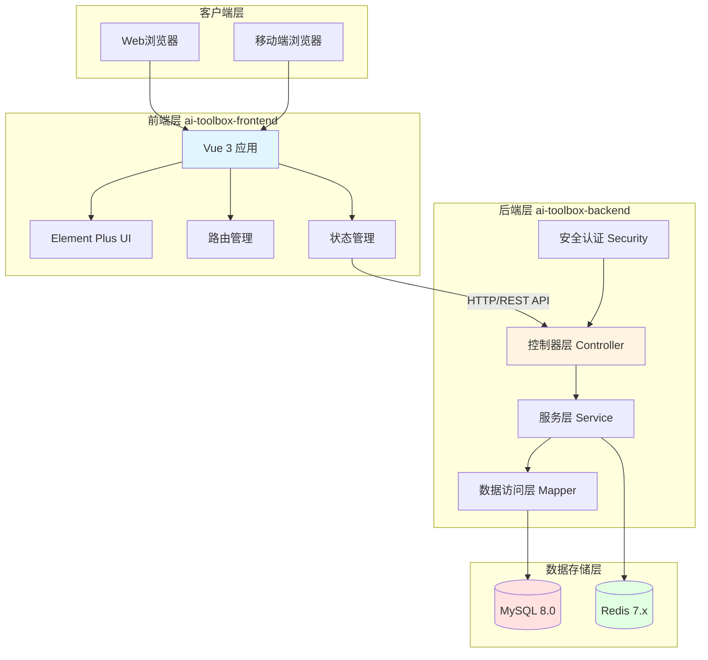

### 3.2 分层架构

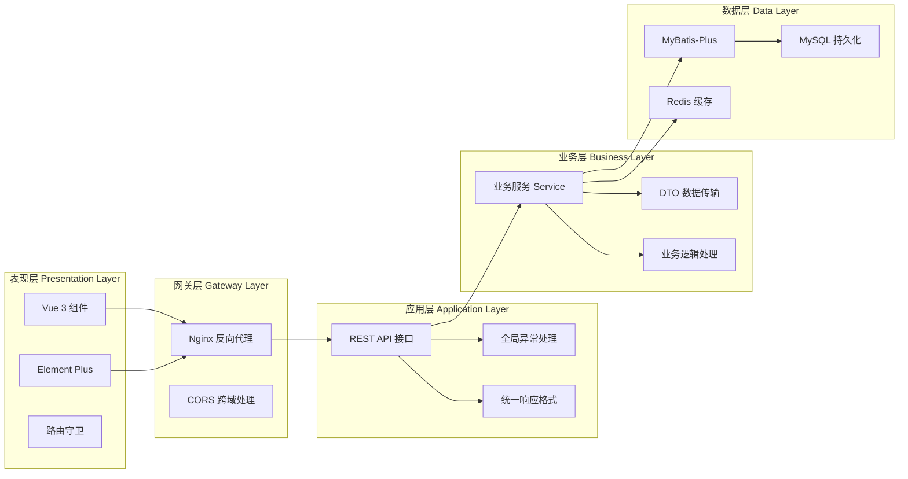

---

## 4. 后端架构设计

### 4.1 后端目录结构

```
ai-toolbox-backend/
├── src/main/java/com/aitoolbox/
│   ├── AiToolboxApplication.java          # 主启动类
│   │
│   ├── common/                            # 通用模块
│   │   ├── Result.java                   # 统一响应结果
│   │   ├── ResultCode.java                # 响应码枚举
│   │   ├── BusinessException.java         # 业务异常
│   │   └── GlobalExceptionHandler.java    # 全局异常处理
│   │
│   ├── config/                            # 配置类
│   │   ├── SecurityConfig.java            # Spring Security配置
│   │   ├── CorsConfig.java                # CORS跨域配置
│   │   └── MybatisPlusConfig.java         # MyBatis-Plus配置
│   │
│   ├── controller/                        # 控制器层
│   │   ├── AiApplicationController.java  # AI应用控制器
│   │   ├── KnowledgeBaseController.java   # 知识库控制器
│   │   ├── AuthController.java           # 认证控制器
│   │   └── UserController.java           # 用户控制器
│   │
│   ├── dto/                               # 数据传输对象
│   │   ├── request/                      # 请求DTO
│   │   │   ├── LoginRequest.java
│   │   │   └── RegisterRequest.java
│   │   └── response/                      # 响应DTO
│   │       └── LoginResponse.java
│   │
│   ├── entity/                            # 实体类
│   │   ├── AiApplication.java             # AI应用实体
│   │   ├── KnowledgeBase.java             # 知识库实体
│   │   ├── User.java                      # 用户实体
│   │   ├── AiCase.java                    # 案例实体
│   │   ├── AiNews.java                    # 资讯实体
│   │   └── AiChatHistory.java             # 聊天记录实体
│   │
│   ├── mapper/                            # 数据访问层
│   │   ├── AiApplicationMapper.java
│   │   ├── KnowledgeBaseMapper.java
│   │   └── UserMapper.java
│   │
│   ├── service/                           # 服务层
│   │   ├── AiApplicationService.java
│   │   ├── UserService.java
│   │   ├── KnowledgeBaseService.java
│   │   └── impl/                          # 服务实现
│   │       ├── AiApplicationServiceImpl.java
│   │       ├── UserServiceImpl.java
│   │       └── KnowledgeBaseServiceImpl.java
│   │
│   ├── security/                          # 安全模块
│   │   └── JwtAuthenticationFilter.java   # JWT过滤器
│   │
│   └── util/                              # 工具类
│       └── JwtUtil.java                   # JWT工具类
│
└── src/main/resources/
    ├── application.yml                    # 应用配置文件
    └── schema.sql                         # 数据库初始化脚本
```

### 4.2 MVC架构流程

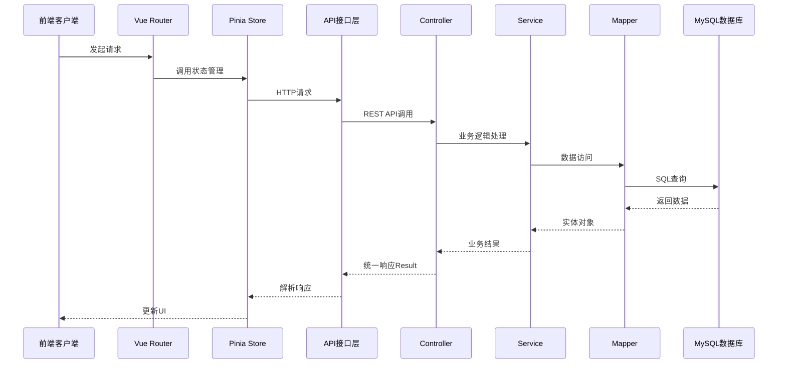

### 4.3 核心类说明

#### 4.3.1 统一响应结果 (Result.java)

```java
@Data
public class Result<T> {
    private Integer code;        // 响应码
    private String message;      // 响应消息
    private T data;              // 响应数据
    private Long timestamp;      // 时间戳
}
```

**响应码设计：**
- `200` - 成功
- `400` - 请求参数错误
- `401` - 未认证
- `403` - 无权限
- `404` - 资源不存在
- `500` - 服务器内部错误

#### 4.3.2 实体类设计

所有实体类使用Lombok注解简化代码，支持MyBatis-Plus的自动填充功能：

```java
@Data
@TableName("ai_application")
public class AiApplication {
    @TableId(type = IdType.AUTO)
    private Long id;

    @TableField(fill = FieldFill.INSERT)
    private LocalDateTime createTime;

    @TableField(fill = FieldFill.INSERT_UPDATE)
    private LocalDateTime updateTime;
}
```

### 4.4 服务层设计

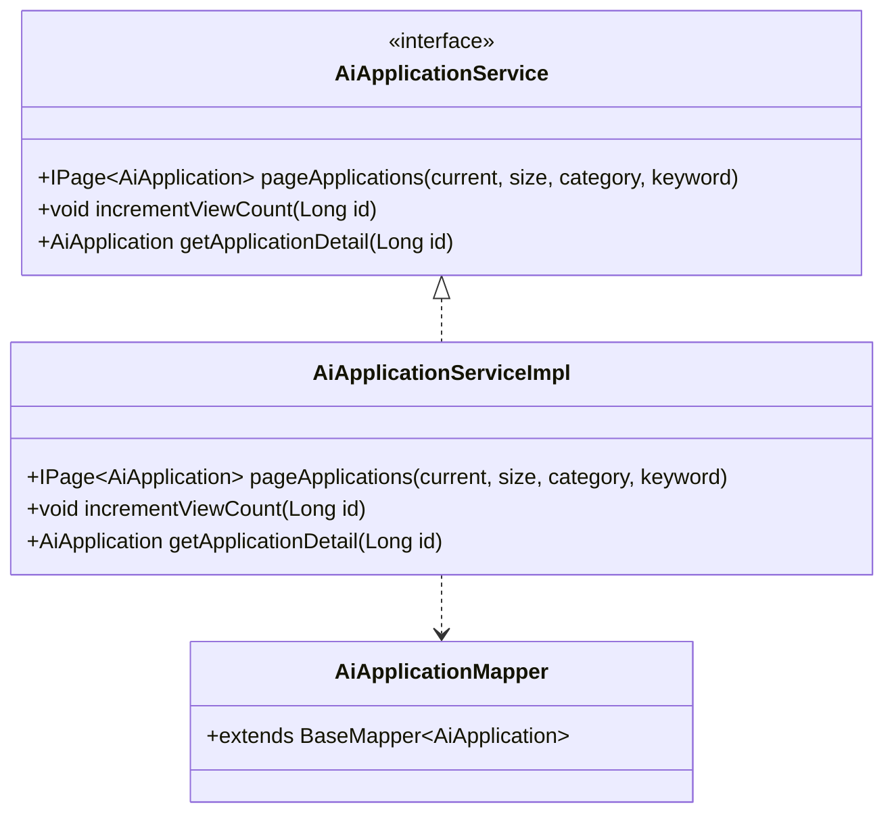

---

## 5. 前端架构设计

### 5.1 前端目录结构

```
ai-toolbox-frontend/
├── src/
│   ├── api/                           # API接口封装
│   │   ├── application.ts             # 应用相关接口
│   │   ├── knowledge.ts               # 知识库接口
│   │   ├── user.ts                    # 用户接口
│   │   └── admin.ts                   # 管理后台接口
│   │
│   ├── assets/                        # 静态资源
│   │   ├── images/                    # 图片资源
│   │   └── styles/                    # 全局样式
│   │
│   ├── components/                    # 公共组件
│   │   └── (可扩展)
│   │
│   ├── router/                        # 路由配置
│   │   └── index.ts                   # 路由定义
│   │
│   ├── stores/                        # 状态管理 (Pinia)
│   │   ├── application.ts             # 应用状态
│   │   ├── user.ts                    # 用户状态
│   │   └── knowledge.ts               # 知识库状态
│   │
│   ├── types/                         # TypeScript类型定义
│   │   ├── application.ts             # 应用类型
│   │   ├── user.ts                    # 用户类型
│   │   └── common.ts                  # 通用类型
│   │
│   ├── utils/                         # 工具函数
│   │   └── request.ts                 # Axios封装
│   │
│   ├── views/                         # 页面组件
│   │   ├── Home.vue                   # 首页
│   │   ├── Login.vue                  # 登录页
│   │   ├── Application.vue            # 应用列表
│   │   ├── ApplicationDetail.vue      # 应用详情
│   │   ├── Knowledge.vue              # 知识库
│   │   ├── KnowledgeDetail.vue        # 知识详情
│   │   ├── Cases.vue                  # AI案例
│   │   ├── News.vue                   # 资讯
│   │   ├── Chat.vue                   # AI问答
│   │   └── admin/                     # 管理后台
│   │       ├── AdminLayout.vue        # 管理布局
│   │       ├── Dashboard.vue          # 数据概览
│   │       ├── ApplicationManage.vue  # 应用管理
│   │       ├── KnowledgeManage.vue    # 知识库管理
│   │       ├── NewsManage.vue         # 资讯管理
│   │       └── UserManage.vue         # 用户管理
│   │
│   ├── App.vue                        # 根组件
│   └── main.ts                        # 应用入口
│
├── public/                            # 公共静态文件
├── index.html                         # HTML模板
├── package.json                       # 依赖配置
├── vite.config.ts                     # Vite配置
├── tsconfig.json                      # TypeScript配置
└── Dockerfile                         # Docker镜像构建
```

### 5.2 前端架构模式

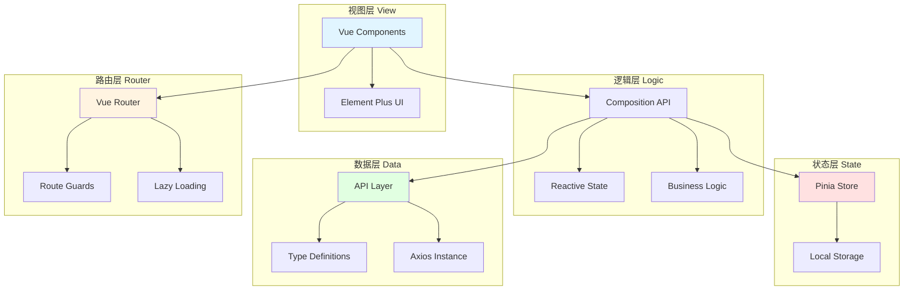

### 5.3 路由设计

#### 路由结构

```mermaid
graph TD
    Root[/]

    Login[/login]
    Register[/register]
    Home[/]
    Application[/applications]
    AppDetail[/applications/:id]
    Knowledge[/knowledge]
    KnowledgeDetail[/knowledge/:id]
    Cases[/cases]
    CaseDetail[/cases/:id]
    News[/news]
    NewsDetail[/news/:id]
    Chat[/chat]

    Admin[/admin]
    AdminDashboard[/admin/dashboard]
    AdminApps[/admin/applications]
    AdminKnowledge[/admin/knowledge]
    AdminNews[/admin/news]
    AdminCases[/admin/cases]
    AdminUsers[/admin/users]

    Root --> Login
    Root --> Register
    Root --> Home
    Root --> Application
    Root --> Knowledge
    Root --> Cases
    Root --> News
    Root --> Chat
    Root --> Admin

    Application --> AppDetail
    Knowledge --> KnowledgeDetail
    Cases --> CaseDetail
    News --> NewsDetail

    Admin --> AdminDashboard
    Admin --> AdminApps
    Admin --> AdminKnowledge
    Admin --> AdminNews
    Admin --> AdminCases
    Admin --> AdminUsers

    style Login fill:#ffe1e1
    style Register fill:#ffe1e1
    style Chat fill:#ffe1e1
    style Admin fill:#fff4e1
```

#### 路由守卫流程

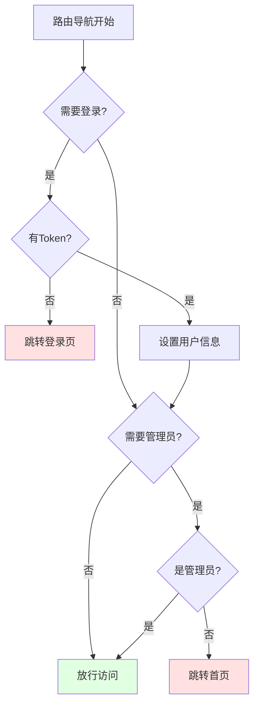

### 5.4 状态管理 (Pinia)

#### Store设计

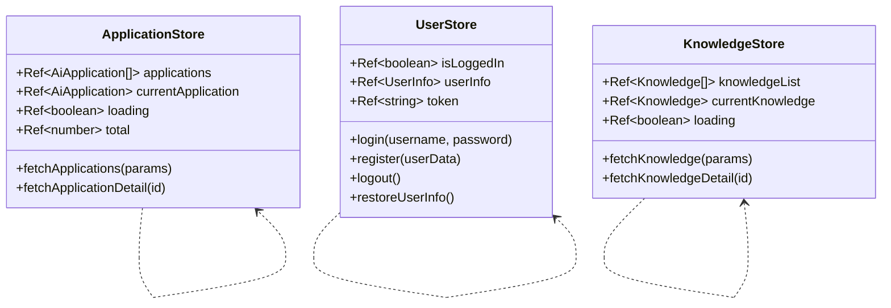

### 5.5 组件通信

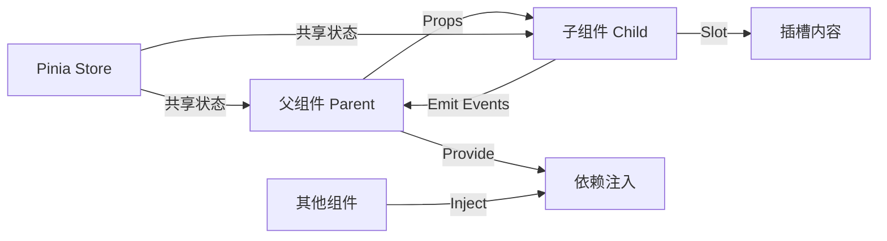

---

## 6. 数据库设计

### 6.1 ER图

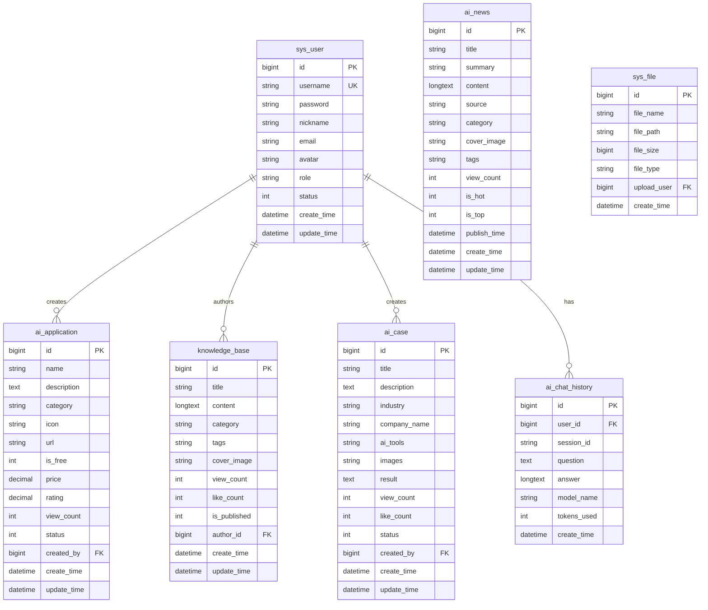

### 6.2 表结构说明

#### 6.2.1 用户表 (sys_user)

| 字段名 | 类型 | 说明 | 约束 |
|--------|------|------|------|
| id | BIGINT | 用户ID | PRIMARY KEY, AUTO_INCREMENT |
| username | VARCHAR(50) | 用户名 | UNIQUE, NOT NULL |
| password | VARCHAR(100) | 密码(BCrypt加密) | NOT NULL |
| nickname | VARCHAR(50) | 昵称 | - |
| email | VARCHAR(100) | 邮箱 | - |
| avatar | VARCHAR(255) | 头像URL | - |
| role | VARCHAR(20) | 角色(ADMIN/USER) | DEFAULT 'USER' |
| status | TINYINT | 状态(1启用/0禁用) | DEFAULT 1 |
| create_time | DATETIME | 创建时间 | DEFAULT CURRENT_TIMESTAMP |
| update_time | DATETIME | 更新时间 | AUTO UPDATE |

#### 6.2.2 AI应用表 (ai_application)

| 字段名 | 类型 | 说明 | 约束 |
|--------|------|------|------|
| id | BIGINT | 应用ID | PRIMARY KEY, AUTO_INCREMENT |
| name | VARCHAR(100) | 应用名称 | NOT NULL |
| description | TEXT | 应用描述 | - |
| category | VARCHAR(50) | 分类 | INDEXED |
| icon | VARCHAR(255) | 图标URL | - |
| url | VARCHAR(255) | 访问地址 | - |
| is_free | TINYINT | 是否免费(1是/0否) | DEFAULT 1 |
| price | DECIMAL(10,2) | 价格 | - |
| rating | DECIMAL(3,2) | 评分(0-5) | DEFAULT 0.00 |
| view_count | INT | 浏览次数 | DEFAULT 0 |
| status | TINYINT | 状态(1上架/0下架) | DEFAULT 1, INDEXED |
| created_by | BIGINT | 创建人ID | FOREIGN KEY → sys_user.id |
| create_time | DATETIME | 创建时间 | DEFAULT CURRENT_TIMESTAMP |
| update_time | DATETIME | 更新时间 | AUTO UPDATE |

#### 6.2.3 知识库表 (knowledge_base)

| 字段名 | 类型 | 说明 | 约束 |
|--------|------|------|------|
| id | BIGINT | 知识库ID | PRIMARY KEY, AUTO_INCREMENT |
| title | VARCHAR(200) | 标题 | NOT NULL |
| content | LONGTEXT | 内容(Markdown) | - |
| category | VARCHAR(50) | 分类 | INDEXED |
| tags | VARCHAR(500) | 标签(逗号分隔) | INDEXED |
| cover_image | VARCHAR(255) | 封面图URL | - |
| view_count | INT | 浏览次数 | DEFAULT 0 |
| like_count | INT | 点赞数 | DEFAULT 0 |
| is_published | TINYINT | 是否发布(1是/0否) | DEFAULT 1 |
| author_id | BIGINT | 作者ID | FOREIGN KEY → sys_user.id |
| create_time | DATETIME | 创建时间 | DEFAULT CURRENT_TIMESTAMP |
| update_time | DATETIME | 更新时间 | AUTO UPDATE |

#### 6.2.4 AI案例表 (ai_case)

| 字段名 | 类型 | 说明 | 约束 |
|--------|------|------|------|
| id | BIGINT | 案例ID | PRIMARY KEY, AUTO_INCREMENT |
| title | VARCHAR(200) | 案例标题 | NOT NULL |
| description | TEXT | 案例描述 | - |
| industry | VARCHAR(50) | 行业 | INDEXED |
| company_name | VARCHAR(100) | 企业名称 | - |
| ai_tools | VARCHAR(500) | 使用的AI工具 | - |
| images | VARCHAR(1000) | 案例图片(逗号分隔) | - |
| result | TEXT | 实施效果 | - |
| view_count | INT | 浏览次数 | DEFAULT 0 |
| like_count | INT | 点赞数 | DEFAULT 0 |
| status | TINYINT | 状态(1发布/0草稿) | DEFAULT 1 |
| created_by | BIGINT | 创建人ID | FOREIGN KEY → sys_user.id |
| create_time | DATETIME | 创建时间 | DEFAULT CURRENT_TIMESTAMP |
| update_time | DATETIME | 更新时间 | AUTO UPDATE |

#### 6.2.5 资讯表 (ai_news)

| 字段名 | 类型 | 说明 | 约束 |
|--------|------|------|------|
| id | BIGINT | 资讯ID | PRIMARY KEY, AUTO_INCREMENT |
| title | VARCHAR(200) | 标题 | NOT NULL |
| summary | VARCHAR(500) | 摘要 | - |
| content | LONGTEXT | 内容(Markdown) | - |
| source | VARCHAR(100) | 来源 | - |
| category | VARCHAR(50) | 分类 | INDEXED |
| cover_image | VARCHAR(255) | 封面图URL | - |
| tags | VARCHAR(500) | 标签(逗号分隔) | - |
| view_count | INT | 浏览次数 | DEFAULT 0 |
| is_hot | TINYINT | 是否热门(1是/0否) | DEFAULT 0 |
| is_top | TINYINT | 是否置顶(1是/0否) | DEFAULT 0 |
| publish_time | DATETIME | 发布时间 | INDEXED |
| create_time | DATETIME | 创建时间 | DEFAULT CURRENT_TIMESTAMP |
| update_time | DATETIME | 更新时间 | AUTO UPDATE |

#### 6.2.6 AI聊天记录表 (ai_chat_history)

| 字段名 | 类型 | 说明 | 约束 |
|--------|------|------|------|
| id | BIGINT | 记录ID | PRIMARY KEY, AUTO_INCREMENT |
| user_id | BIGINT | 用户ID | FOREIGN KEY → sys_user.id, INDEXED |
| session_id | VARCHAR(50) | 会话ID | INDEXED |
| question | TEXT | 问题 | NOT NULL |
| answer | LONGTEXT | 回答 | - |
| model_name | VARCHAR(50) | 使用的模型名称 | - |
| tokens_used | INT | 使用的token数 | - |
| create_time | DATETIME | 创建时间 | DEFAULT CURRENT_TIMESTAMP, INDEXED |

### 6.3 索引设计

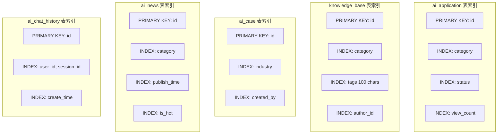

---

## 7. API接口设计

### 7.1 API设计原则

- **RESTful风格**：遵循REST架构风格
- **统一响应格式**：所有接口返回统一的Result结构
- **版本控制**：API路径包含版本号
- **HTTP动词**：正确使用GET/POST/PUT/DELETE
- **状态码规范**：正确使用HTTP状态码

### 7.2 统一响应格式

```typescript
// 成功响应
{
  "code": 200,
  "message": "操作成功",
  "data": { /* 业务数据 */ },
  "timestamp": 1704067200000
}

// 失败响应
{
  "code": 500,
  "message": "操作失败",
  "data": null,
  "timestamp": 1704067200000
}
```

### 7.3 核心API接口

#### 7.3.1 认证接口

| 方法 | 路径 | 说明 | 权限 |
|------|------|------|------|
| POST | /api/auth/login | 用户登录 | 公开 |
| POST | /api/auth/register | 用户注册 | 公开 |
| GET | /api/auth/user/info | 获取当前用户信息 | 需登录 |

**登录接口示例：**
```http
POST /api/auth/login
Content-Type: application/json

{
  "username": "admin",
  "password": "admin123"
}

Response:
{
  "code": 200,
  "message": "登录成功",
  "data": {
    "token": "eyJhbGciOiJIUzUxMiJ9...",
    "userInfo": {
      "id": 1,
      "username": "admin",
      "nickname": "管理员",
      "role": "ADMIN"
    }
  },
  "timestamp": 1704067200000
}
```

#### 7.3.2 AI应用接口

| 方法 | 路径 | 说明 | 权限 |
|------|------|------|------|
| GET | /api/applications/page | 分页查询应用列表 | 公开 |
| GET | /api/applications/adminpage | 管理员分页查询 | 管理员 |
| GET | /api/applications/{id} | 获取应用详情 | 公开 |
| POST | /api/applications/{id}/view | 增加浏览次数 | 公开 |
| POST | /api/applications | 新增应用 | 管理员 |
| PUT | /api/applications/{id} | 更新应用 | 管理员 |
| DELETE | /api/applications/{id} | 删除应用 | 管理员 |

**分页查询示例：**
```http
GET /api/applications/page?current=1&size=10&category=对话助手&keyword=ChatGPT

Response:
{
  "code": 200,
  "message": "操作成功",
  "data": {
    "records": [
      {
        "id": 1,
        "name": "ChatGPT",
        "description": "OpenAI开发的大型语言模型...",
        "category": "对话助手",
        "url": "https://chat.openai.com",
        "isFree": 0,
        "rating": 4.8,
        "viewCount": 1250
      }
    ],
    "total": 1,
    "size": 10,
    "current": 1,
    "pages": 1
  }
}
```

#### 7.3.3 知识库接口

| 方法 | 路径 | 说明 | 权限 |
|------|------|------|------|
| GET | /api/knowledge/page | 分页查询知识库 | 公开 |
| GET | /api/knowledge/{id} | 获取知识详情 | 公开 |
| POST | /api/knowledge | 新增知识 | 管理员 |
| PUT | /api/knowledge/{id} | 更新知识 | 管理员 |
| DELETE | /api/knowledge/{id} | 删除知识 | 管理员 |

#### 7.3.4 用户接口

| 方法 | 路径 | 说明 | 权限 |
|------|------|------|------|
| GET | /api/users/page | 分页查询用户 | 管理员 |
| GET | /api/users/{id} | 获取用户详情 | 管理员 |
| PUT | /api/users/{id} | 更新用户信息 | 管理员 |
| DELETE | /api/users/{id} | 删除用户 | 管理员 |

### 7.4 API请求流程

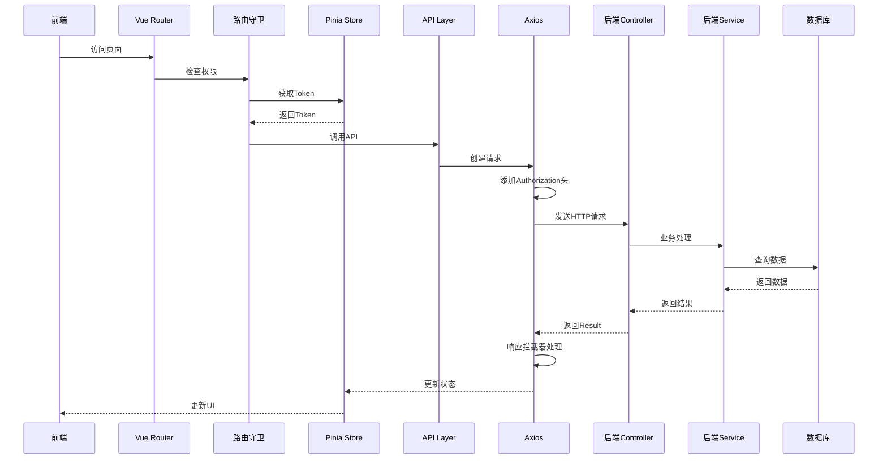

---

## 8. 安全架构

### 8.1 安全架构图

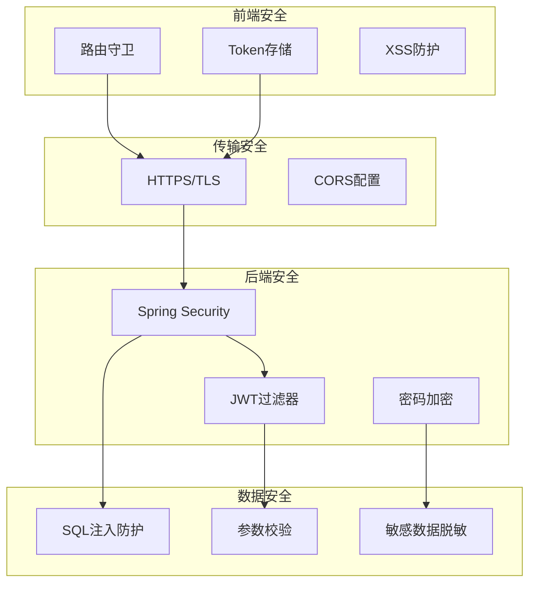

### 8.2 JWT认证流程

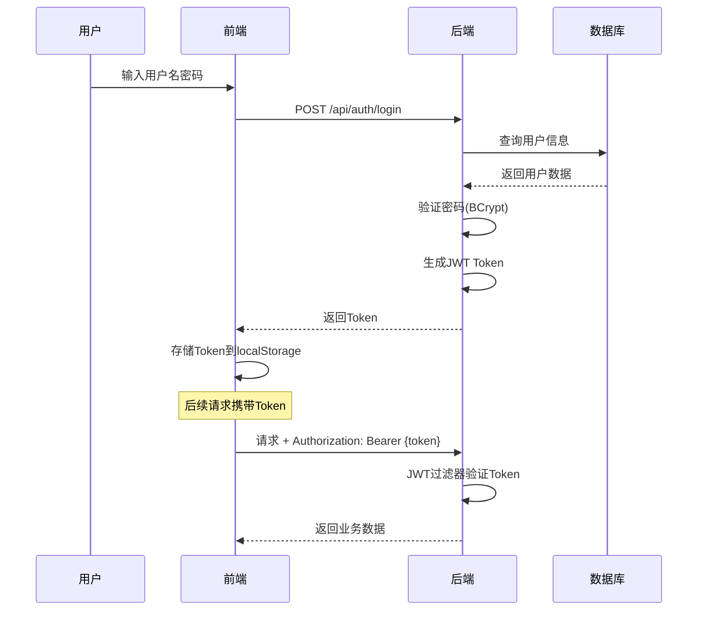

### 8.3 安全策略

#### 8.3.1 前端安全

1. **路由守卫**
   - 需登录页面：检查Token存在性
   - 管理员页面：检查用户角色

2. **XSS防护**
   - 使用Vue的v-html时谨慎
   - 用户输入内容进行转义

3. **Token管理**
   - Token存储在localStorage
   - 请求时自动添加到Authorization头

#### 8.3.2 后端安全

1. **Spring Security配置**
   ```java
   @Configuration
   @EnableWebSecurity
   public class SecurityConfig {
       @Bean
       public SecurityFilterChain filterChain(HttpSecurity http) {
           http
               .csrf(AbstractHttpConfigurer::disable)
               .authorizeHttpRequests(auth -> auth.anyRequest().permitAll());
           return http.build();
       }
   }
   ```

2. **JWT过滤器**
   - 从请求头提取Token
   - 验证Token有效性
   - 设置Security上下文

3. **密码加密**
   - 使用BCrypt算法加密
   - 存储加密后的密码

4. **CORS配置**
   ```java
   @Configuration
   public class CorsConfig {
       @Bean
       public CorsFilter corsFilter() {
           CorsConfiguration config = new CorsConfiguration();
           config.addAllowedOrigin("*");
           config.addAllowedHeader("*");
           config.addAllowedMethod("*");
           config.setAllowCredentials(true);
           return new CorsFilter(new UrlBasedCorsConfigurationSource());
       }
   }
   ```

---

## 9. 部署架构

### 9.1 Docker部署架构

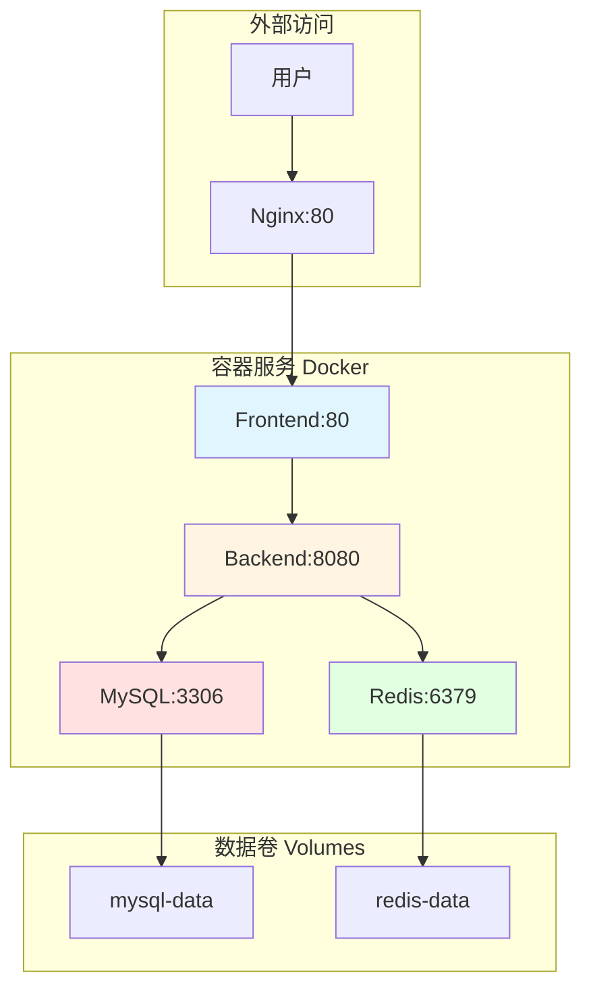

### 9.2 Docker Compose配置

```yaml
version: '3.8'

services:
  mysql:
    image: mysql:8.0
    ports: ["3306:3306"]
    environment:
      MYSQL_ROOT_PASSWORD: root123
      MYSQL_DATABASE: ai_toolbox
    volumes:
      - mysql-data:/var/lib/mysql
    healthcheck:
      test: ["CMD", "mysqladmin", "ping", "-h", "localhost"]

  redis:
    image: redis:7-alpine
    ports: ["6379:6379"]
    volumes:
      - redis-data:/data
    healthcheck:
      test: ["CMD", "redis-cli", "ping"]

  backend:
    build: ./ai-toolbox-backend
    ports: ["8080:8080"]
    depends_on:
      mysql: { condition: service_healthy }
      redis: { condition: service_healthy }

  frontend:
    build: ./ai-toolbox-frontend
    ports: ["80:80"]
    depends_on: [backend]

volumes:
  mysql-data:
  redis-data:
```

### 9.3 启动流程

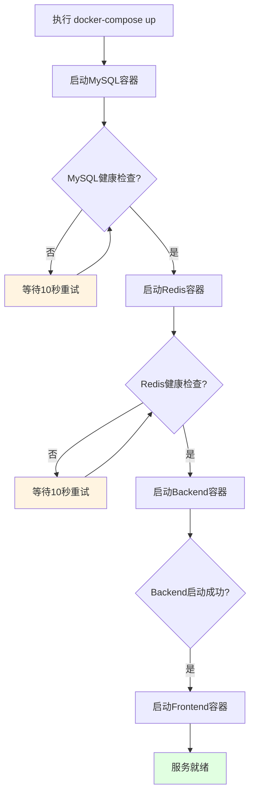

### 9.4 端口映射

| 服务 | 容器端口 | 宿主机端口 | 说明 |
|------|---------|-----------|------|
| Frontend (Nginx) | 80 | 80 | Web服务 |
| Backend (Spring Boot) | 8080 | 8080 | API服务 |
| MySQL | 3306 | 3306 | 数据库 |
| Redis | 6379 | 6379 | 缓存服务 |

---

## 10. 数据流设计

### 10.1 应用列表数据流

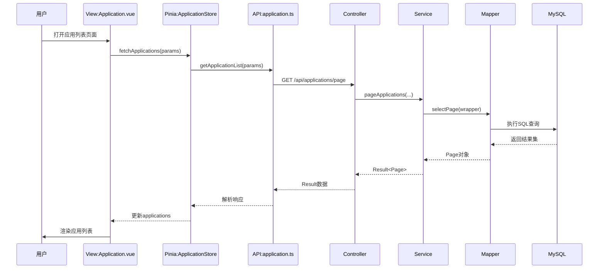

### 10.2 登录认证数据流

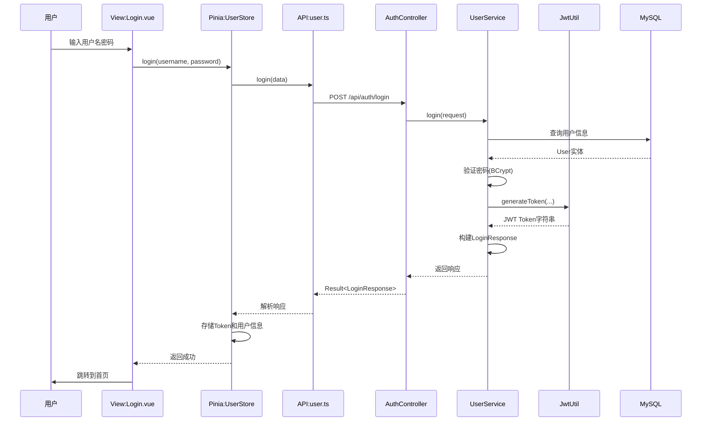

---

## 11. 扩展性设计

### 11.1 模块化设计

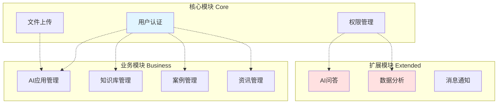

### 11.2 缓存策略

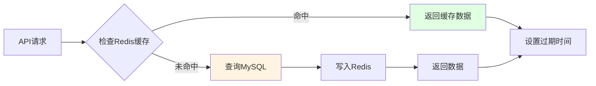

**缓存策略：**
- 热门应用列表：缓存5分钟
- 知识库详情：缓存10分钟
- 用户信息：缓存30分钟
- 配置数据：缓存1小时

### 11.3 可扩展点

1. **前端扩展**
   - 新增模块：添加新的路由和页面组件
   - 组件复用：提取公共组件到components目录
   - 插件集成：可集成Element Plus插件

2. **后端扩展**
   - 新增业务模块：遵循Controller-Service-Mapper模式
   - 数据库扩展：添加新表和对应的实体类
   - 中间件扩展：添加自定义过滤器和拦截器

3. **第三方集成**
   - AI模型集成：可接入OpenAI、Claude等API
   - 支付集成：可接入支付宝、微信支付
   - 搜索引擎：可接入Elasticsearch

---

## 12. 性能优化策略

### 12.1 前端优化

```mermaid
mindmap
  root((前端优化))
    代码层面
      路由懒加载
      组件按需引入
      Tree Shaking
    资源层面
      图片压缩
      CDN加速
      Gzip压缩
    渲染层面
      虚拟滚动
      防抖节流
      请求合并
    缓存层面
      HTTP缓存
      LocalStorage
      Service Worker
```

### 12.2 后端优化

```mermaid
mindmap
  root((后端优化))
    数据库优化
      索引优化
      SQL优化
      读写分离
    缓存优化
      Redis缓存
      多级缓存
      缓存预热
    接口优化
      批量查询
      分页优化
      异步处理
    JVM优化
      内存配置
      GC调优
      线程池优化
```

### 12.3 数据库优化

1. **索引优化**
   - 为常用查询字段添加索引
   - 使用复合索引优化多条件查询
   - 定期分析和优化索引

2. **查询优化**
   - 避免SELECT *
   - 使用MyBatis-Plus的分页插件
   - 优化JOIN操作

3. **连接池配置**
   ```yaml
   spring:
     datasource:
       hikari:
         minimum-idle: 5
         maximum-pool-size: 20
         connection-timeout: 30000
   ```

---

## 附录

### A. 项目启动指南

#### A.1 开发环境启动

**启动后端：**
```bash
cd ai-toolbox-backend
mvn clean install
mvn spring-boot:run
```

**启动前端：**
```bash
cd ai-toolbox-frontend
npm install
npm run dev
```

#### A.2 Docker启动

```bash
# 构建并启动所有服务
docker-compose up -d

# 查看日志
docker-compose logs -f

# 停止服务
docker-compose down
```

### B. 测试账户

| 角色 | 用户名 | 密码 | 权限 |
|------|--------|------|------|
| 管理员 | admin | admin123 | 全部权限 |
| 普通用户 | test | admin123 | 基础权限 |

### C. 访问地址

| 服务 | 地址 | 说明 |
|------|------|------|
| 前端(开发) | http://localhost:3000 | 开发环境 |
| 前端(Docker) | http://localhost | 生产环境 |
| 后端API | http://localhost:8080/api | RESTful接口 |
| MySQL | localhost:3306 | 数据库 |
| Redis | localhost:6379 | 缓存服务 |

### D. 技术文档链接

- [Vue 3 官方文档](https://cn.vuejs.org/)
- [Spring Boot 官方文档](https://spring.io/projects/spring-boot)
- [MyBatis-Plus 官方文档](https://baomidou.com/)
- [Element Plus 官方文档](https://element-plus.org/)

---

**文档版本：** v1.1
**最后更新：** 2026-01-30
**维护者：** AI工具箱开发团队
